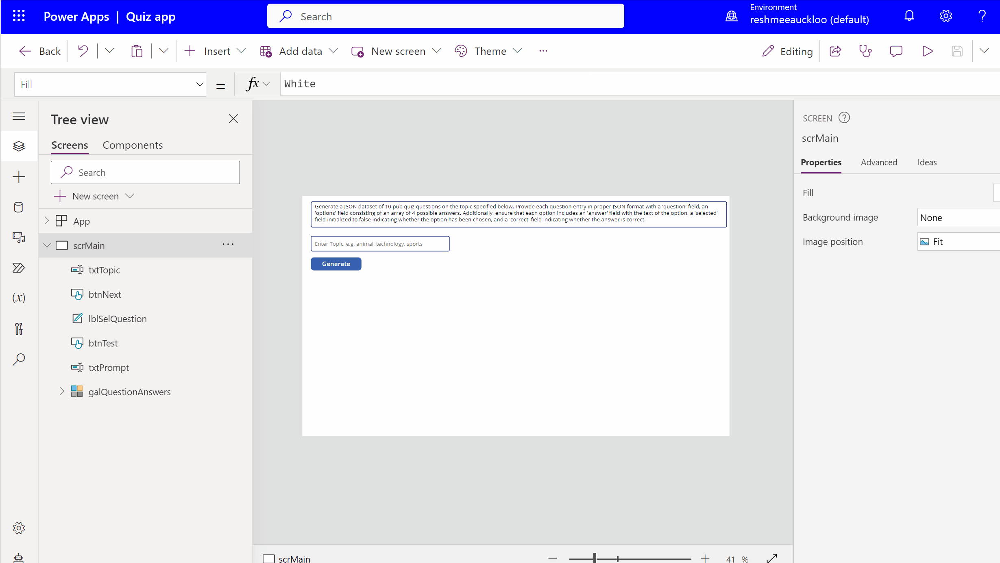

# Quiz App Power App Ai Hack

The app uses the OpenAI ChatGPT independent publisher connector.

This was inspired from [Add OpenAI Capabilities to your Power Platform solutions](https://www.youtube.com/watch?v=AVK7BUmTGvs&t=1062s) by [Robin Rosengrün](https://twitter.com/power_r2)

The prompt used to send to chatGPT is "Generate a JSON dataset of 10 pub quiz questions. Provide each question entry in proper JSON format with a 'question' field, an 'options' field consisting of an array of 4 possible answers. Additionally, ensure that each option includes an 'answer' field with the text of the option, a 'selected' field initialized to false indicating whether the option has been chosen, and a 'correct' field indicating whether the answer is correct"

Sample data returned is the format 

```JSON
[
    {
        "question": "What is the capital of France?",
        "options": [
            {"Answer": "Berlin", "Selected": false, "Correct": false},
            {"Answer": "Madrid", "Selected": false, "Correct": false},
            {"Answer": "Rome", "Selected": false, "Correct": false},
            {"Answer": "Paris", "Selected": false, "Correct": true}
        ]
    },
    {
        "question": "Which planet is known as the 'Red Planet'?",
        "options": [
            {"Answer": "Venus", "Selected": false, "Correct": false},
            {"Answer": "Mars", "Selected": false, "Correct": true},
            {"Answer": "Jupiter", "Selected": false, "Correct": false},
            {"Answer": "Saturn", "Selected": false, "Correct": false}
        ]
    },
    {
        "question": "Who wrote the play 'Romeo and Juliet'?",
        "options": [
            {"Answer": "William Shakespeare", "Selected": false, "Correct": true},
            {"Answer": "Charles Dickens", "Selected": false, "Correct": false},
            {"Answer": "Jane Austen", "Selected": false, "Correct": false},
            {"Answer": "Mark Twain", "Selected": false, "Correct": false}
        ]
    },
    {
        "question": "What is the chemical symbol for water?",
        "options": [
            {"Answer": "O2", "Selected": false, "Correct": false},
            {"Answer": "H2O", "Selected": false, "Correct": true},
            {"Answer": "CO2", "Selected": false, "Correct": false},
            {"Answer": "CH4", "Selected": false, "Correct": false}
        ]
    },
    {
        "question": "In which year did the Titanic sink?",
        "options": [
            {"Answer": "1905", "Selected": false, "Correct": false},
            {"Answer": "1912", "Selected": false, "Correct": true},
            {"Answer": "1920", "Selected": false, "Correct": false},
            {"Answer": "1931", "Selected": false, "Correct": false}
        ]
    },
    {
        "question": "What is the largest mammal on Earth?",
        "options": [
            {"Answer": "Elephant", "Selected": false, "Correct": false},
            {"Answer": "Blue Whale", "Selected": false, "Correct": true},
            {"Answer": "Lion", "Selected": false, "Correct": false},
            {"Answer": "Giraffe", "Selected": false, "Correct": false}
        ]
    },
    {
        "question": "Who painted the Mona Lisa?",
        "options": [
            {"Answer": "Vincent van Gogh", "Selected": false, "Correct": false},
            {"Answer": "Pablo Picasso", "Selected": false, "Correct": false},
            {"Answer": "Leonardo da Vinci", "Selected": false, "Correct": true},
            {"Answer": "Michelangelo", "Selected": false, "Correct": false}
        ]
    },
    {
        "question": "What is the chemical symbol for gold?",
        "options": [
            {"Answer": "Ag", "Selected": false, "Correct": false},
            {"Answer": "Au", "Selected": false, "Correct": true},
            {"Answer": "Fe", "Selected": false, "Correct": false},
            {"Answer": "Cu", "Selected": false, "Correct": false}
        ]
    },
    {
        "question": "Which country is known as the Land of the Rising Sun?",
        "options": [
            {"Answer": "China", "Selected": false, "Correct": false},
            {"Answer": "Japan", "Selected": false, "Correct": true},
            {"Answer": "South Korea", "Selected": false, "Correct": false},
            {"Answer": "Thailand", "Selected": false, "Correct": false}
        ]
    },
    {
        "question": "Who was the first man to step on the moon?",
        "options": [
            {"Answer": "Buzz Aldrin", "Selected": false, "Correct": false},
            {"Answer": "Yuri Gagarin", "Selected": false, "Correct": false},
            {"Answer": "Neil Armstrong", "Selected": false, "Correct": true},
            {"Answer": "John Glenn", "Selected": false, "Correct": false}
        ]
    }
]
```

ParseJson function has been used to convert the JSON response into a table to bind to a gallery of questions. 

Each time the generate button is clicked, random set of questions is generated,

Watch everything is action by watching 


